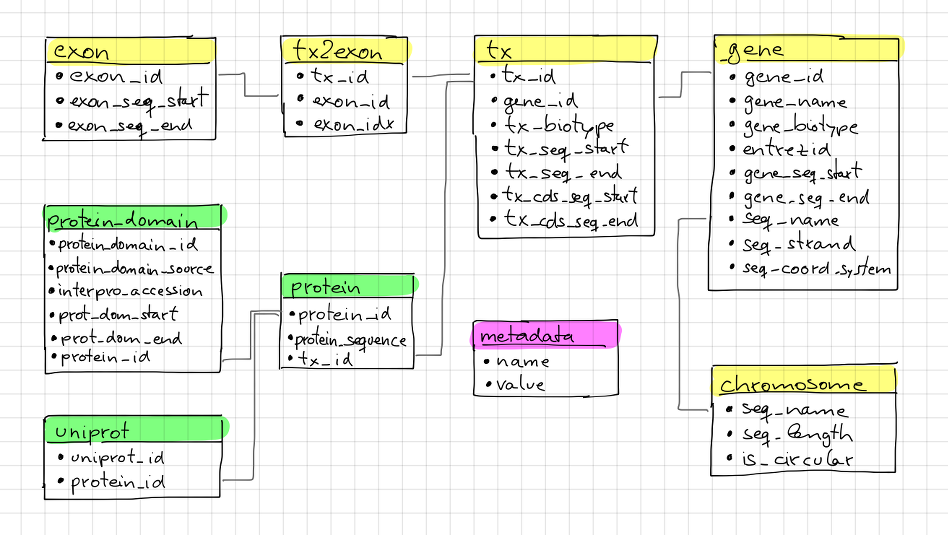

**Package**: `r Biocpkg("ensembldb")`<br />
**Authors**: `r packageDescription("ensembldb")$Author`<br />
**Modified**: 4 February, 2016<br />
**Compiled**: `r date()`

# Introduction

The `ensembldb` package provides functions to create and use transcript centric
annotation databases/packages. The annotation for the databases are directly
fetched from Ensembl <sup><a id="fnr.1" class="footref" href="#fn.1">1</a></sup> using their Perl API.  The functionality and data is
similar to that of the `TxDb` packages from the `GenomicFeatures` package, but,
in addition to retrieve all gene/transcript models and annotations from the
database, the `ensembldb` package provides also a filter framework allowing to
retrieve annotations for specific entries like genes encoded on a chromosome
region or transcript models of lincRNA genes.  In the databases, along with the
gene and transcript models and their chromosomal coordinates, additional
annotations including the gene name (symbol) and NCBI Entrezgene identifiers as
well as the gene and transcript biotypes are stored too (see Section
[11](#orgtarget1) for the database layout and an overview of available
attributes/columns).

Another main goal of this package is to generate *versioned* annotation
packages, i.e. annotation packages that are build for a specific Ensembl
release, and are also named according to that (e.g. `EnsDb.Hsapiens.v75` for
human gene definitions of the Ensembl code database version 75). This ensures
reproducibility, as it allows to load annotations from a specific Ensembl
release also if newer versions of annotation packages/releases are available. It
also allows to load multiple annotation packages at the same time in order to
e.g. compare gene models between Ensembl releases.

In the example below we load an Ensembl based annotation package for Homo
sapiens, Ensembl version 75. The connection to the database is bound to the
variable `EnsDb.Hsapiens.v75`.

```{r warning=FALSE, message=FALSE}
library(EnsDb.Hsapiens.v75)

## Making a "short cut"
edb <- EnsDb.Hsapiens.v75
## print some informations for this package
edb

## for what organism was the database generated?
organism(edb)
```

# Using `ensembldb` annotation packages to retrieve specific annotations

The `ensembldb` package provides a set of filter objects allowing to specify
which entries should be fetched from the database. The complete list of filters,
which can be used individually or can be combined, is shown below (in
alphabetical order):

-   `ExonidFilter`: allows to filter the result based on the (Ensembl) exon
    identifiers.
-   `ExonrankFilter`: filter results on the rank (index) of an exon within the
    transcript model. Exons are always numbered from 5' to 3' end of the
    transcript, thus, also on the reverse strand, the exon 1 is the most 5' exon
    of the transcript.
-   `EntrezidFilter`: allows to filter results based on NCBI Entrezgene
    identifiers of the genes.
-   `GenebiotypeFilter`: allows to filter for the gene biotypes defined in the
    Ensembl database; use the `listGenebiotypes` method to list all available
    biotypes.
-   `GeneidFilter`: allows to filter based on the Ensembl gene IDs.
-   `GenenameFilter`: allows to filter based on the names (symbols) of the genes.
-   `GRangesFilter`: allows to retrieve all features (genes, transcripts or exons)
    that are either within (setting =condition = "within"=) or partially
    overlapping (`condition = "overlapping"=) the defined genomic
      region/range. Note that, depending on the called method (=genes`,
    `transcripts` or `exons`) the start and end coordinates of either the genes,
    transcripts or exons are used for the filter. For methods `exonsBy`, `cdsBy`
    and `txBy` the coordinates of `by` are used.
-   `SeqendFilter`: filter based on the chromosomal end coordinate of the exons,
    transcripts or genes (correspondingly set =feature = "exon"=, =feature = "tx"= or
    =feature = "gene"=).
-   `SeqnameFilter`: filter by the name of the chromosomes the genes are encoded
    on.
-   `SeqstartFilter`: filter based on the chromosomal start coordinates of the
    exons, transcripts or genes (correspondingly set =feature = "exon"=,
    =feature = "tx"= or =feature = "gene"=).
-   `SeqstrandFilter`: filter for the chromosome strand on which the genes are
    encoded.
-   `TxbiotypeFilter`: filter on the transcript biotype defined in Ensembl; use
    the `listTxbiotypes` method to list all available biotypes.
-   `TxidFilter`: filter on the Ensembl transcript identifiers.

Each of the filter classes can take a single value or a vector of values (with
the exception of the `SeqendFilter` and `SeqstartFilter`) for comparison. In
addition, it is possible to specify the *condition* for the filter,
e.g. setting `condition` to = to retrieve all entries matching the filter value,
to != to negate the filter or setting `condition = "like"= to allow
partial matching. The =condition` parameter for `SeqendFilter` and
`SeqendFilter` can take the values = , >, >=, < and <= (since these
filters base on numeric values).

A simple example would be to get all transcripts for the gene *BCL2L11*. To this
end we specify a `GenenameFilter` with the value ="BCL2L11"`. As a result we get
a =GRanges` object with `start`, `end`, `strand` and `seqname` of the `GRanges`
object being the start coordinate, end coordinate, chromosome name and strand
for the respective transcripts. All additional annotations are available as
metadata columns. Alternatively, by setting `return.type = "DataFrame"=, or
=return.type`"data.frame"= the method would return a `DataFrame` object or
`data.frame`.

```{r }
Tx <- transcripts(edb, filter=list(GenenameFilter("BCL2L11")))

Tx

## as this is a GRanges object we can access e.g. the start coordinates with
head(start(Tx))

## or extract the biotype with
head(Tx$tx_biotype)
```

The parameter `columns` of the `exons`, `genes` and `transcripts` method allow
to specify which database attributes (columns) should be retrieved. Note that
these are not restricted to columns of the corresponding database table
(e.g. columns of database table *gene* for `genes`). To get an overview of
database tables and available columns the function `listTables` can be used. The
method `listColumns` on the other hand lists columns for the specified database
table.

```{r }
## list all database tables along with their columns
listTables(edb)

## list columns from a specific table
listColumns(edb, "tx")
```

Thus, we could retrieve all transcripts of the biotype *nonsense\_mediated\_decay*
(which, according to the definitions by Ensembl are transcribed, but most likely
not translated in a protein, but rather degraded after transcription) along with
the name of the gene for each transcript. Note that we are changing here the
`return.type` to `DataFrame`, so the method will return a `DataFrame` with the
results instead of the default `GRanges`.

```{r }
Tx <- transcripts(edb,
		  columns=c(listColumns(edb , "tx"), "gene_name"),
		  filter=TxbiotypeFilter("nonsense_mediated_decay"),
		  return.type="DataFrame")
nrow(Tx)
Tx
```

For protein coding transcripts, we can also specifically extract their coding
region. In the example below we extract the CDS for all transcripts encoded on
chromosome Y.

```{r }
yCds <- cdsBy(edb, filter=SeqnameFilter("Y"))
yCds
```

Using a `GRangesFilter` we can retrieve all features from the database that are
either within or overlapping the specified genomic region. In the example
below we query all genes that are partially overlapping with a small region on
chromosome 11. The filter restricts to all genes for which either an exon or an
intron is partially overlapping with the region.

```{r }
## Define the filter
grf <- GRangesFilter(GRanges("11", ranges=IRanges(114000000, 114000050),
			     strand="+"), condition="overlapping")

## Query genes:
gn <- genes(edb, filter=grf)
gn

## Next we retrieve all transcripts for that gene so that we can plot them.
txs <- transcripts(edb, filter=GenenameFilter(gn$gene_name))
```

```{r tx-for-zbtb16, message=FALSE, fig.align='center', fig.width=7.5, fig.height=5}
plot(3, 3, pch=NA, xlim=c(start(gn), end(gn)), ylim=c(0, length(txs)), yaxt="n", ylab="")
## Highlight the GRangesFilter region
rect(xleft=start(grf), xright=end(grf), ybottom=0, ytop=length(txs), col="red", border="red")
for(i in 1:length(txs)){
    current <- txs[i]
    rect(xleft=start(current), xright=end(current), ybottom=i-0.975, ytop=i-0.125, border="grey")
    text(start(current), y=i-0.5,pos=4, cex=0.75, labels=current$tx_id)
}
```

As we can see, 4 transcripts of the gene ZBTB16 are also overlapping the
region. Below we fetch these 4 transcripts. Note, that a call to `exons` will
not return any features from the database, as no exon is overlapping with the
region.

```{r }
transcripts(edb, filter=grf)
```

The `GRangesFilter` supports also `GRanges` defining multiple regions and a
query will return all features overlapping any of these regions. Besides using
the `GRangesFilter` it is also possible to search for transcripts or exons
overlapping genomic regions using the `exonsByOverlaps` or
`transcriptsByOverlaps` known from the `GenomicFeatures` package. Note that the
implementation of these methods for `EnsDb` objects supports also to use filters
to further fine-tune the query.

To get an overview of allowed/available gene and transcript biotype the
functions `listGenebiotypes` and `listTxbiotypes` can be used.

```{r }
## Get all gene biotypes from the database. The GenebiotypeFilter
## allows to filter on these values.
listGenebiotypes(edb)

## Get all transcript biotypes from the database.
listTxbiotypes(edb)
```

Data can be fetched in an analogous way using the `exons` and `genes`
methods. In the example below we retrieve `gene_name`, `entrezid` and the
`gene_biotype` of all genes in the database which names start with ="BCL2"=.

```{r }
## We're going to fetch all genes which names start with BCL. To this end
## we define a GenenameFilter with partial matching, i.e. condition "like"
## and a % for any character/string.
BCLs <- genes(edb,
	      columns=c("gene_name", "entrezid", "gene_biotype"),
	      filter=list(GenenameFilter("BCL%", condition="like")),
	      return.type="DataFrame")
nrow(BCLs)
BCLs
```

Sometimes it might be useful to know the length of genes or transcripts
(i.e. the total sum of nucleotides covered by their exons). Below we calculate
the mean length of transcripts from protein coding genes on chromosomes X and Y
as well as the average length of snoRNA, snRNA and rRNA transcripts encoded on
these chromosomes.

```{r }
## determine the average length of snRNA, snoRNA and rRNA genes encoded on
## chromosomes X and Y.
mean(lengthOf(edb, of="tx",
	      filter=list(GenebiotypeFilter(c("snRNA", "snoRNA", "rRNA")),
		  SeqnameFilter(c("X", "Y")))))

## determine the average length of protein coding genes encoded on the same
## chromosomes.
mean(lengthOf(edb, of="tx",
	      filter=list(GenebiotypeFilter("protein_coding"),
		  SeqnameFilter(c("X", "Y")))))
```

Not unexpectedly, transcripts of protein coding genes are longer than those of
snRNA, snoRNA or rRNA genes.

At last we extract the first two exons of each transcript model from the
database.

```{r }
## Extract all exons 1 and (if present) 2 for all genes encoded on the
## Y chromosome
exons(edb, columns=c("tx_id", "exon_idx"),
      filter=list(SeqnameFilter("Y"),
		  ExonrankFilter(3, condition="<")))
```

# Extracting gene/transcript/exon models for RNASeq feature counting

For the feature counting step of an RNAseq experiment, the gene or transcript
models (defined by the chromosomal start and end positions of their exons) have
to be known. To extract these from an Ensembl based annotation package, the
`exonsBy`, `genesBy` and `transcriptsBy` methods can be used in an analogous way
as in `TxDb` packages generated by the `GenomicFeatures` package.  However, the
`transcriptsBy` method does not, in contrast to the method in the
`GenomicFeatures` package, allow to return transcripts by ="cds"`. While the
annotation packages built by the =ensembldb` contain the chromosomal start and
end coordinates of the coding region (for protein coding genes) they do not
assign an ID to each CDS.

A simple use case is to retrieve all genes encoded on chromosomes X and Y from
the database.

```{r }
TxByGns <- transcriptsBy(edb, by="gene",
			 filter=list(SeqnameFilter(c("X", "Y")))
			 )
TxByGns
```

Since Ensembl contains also definitions of genes that are on chromosome variants
(supercontigs), it is advisable to specify the chromosome names for which the
gene models should be returned.

In a real use case, we might thus want to retrieve all genes encoded on the
*standard* chromosomes. In addition it is advisable to use a `GeneidFilter` to
restrict to Ensembl genes only, as also *LRG* (Locus Reference Genomic)
genes<sup><a id="fnr.2" class="footref" href="#fn.2">2</a></sup> are defined in the database, which are partially redundant with
Ensembl genes.

```{r eval=FALSE}
## will just get exons for all genes on chromosomes 1 to 22, X and Y.
## Note: want to get rid of the "LRG" genes!!!
EnsGenes <- exonsBy(edb, by="gene",
		    filter=list(SeqnameFilter(c(1:22, "X", "Y")),
			GeneidFilter("ENSG%", "like")))
```

The code above returns a `GRangesList` that can be used directly as an input for
the `summarizeOverlaps` function from the `GenomicAlignments` package <sup><a id="fnr.3" class="footref" href="#fn.3">3</a></sup>.

Alternatively, the above `GRangesList` can be transformed to a `data.frame` in
*SAF* format that can be used as an input to the `featureCounts` function of the
`Rsubread` package <sup><a id="fnr.4" class="footref" href="#fn.4">4</a></sup>.

```{r eval=FALSE}
## Transforming the GRangesList into a data.frame in SAF format
EnsGenes.SAF <- toSAF(EnsGenes)
```

Note that the ID by which the `GRangesList` is split is used in the SAF
formatted `data.frame` as the `GeneID`. In the example below this would be the
Ensembl gene IDs, while the start, end coordinates (along with the strand and
chromosomes) are those of the the exons.

In addition, the `disjointExons` function (similar to the one defined in
`GenomicFeatures`) can be used to generate a `GRanges` of non-overlapping exon
parts which can be used in the `DEXSeq` package.

```{r eval=FALSE}
## Create a GRanges of non-overlapping exon parts.
DJE <- disjointExons(edb,
		     filter=list(SeqnameFilter(c(1:22, "X", "Y")),
			  GeneidFilter("ENSG%", "like")))
```

# Retrieving sequences for gene/transcript/exon models

The methods to retrieve exons, transcripts and genes (i.e. `exons`,
`transcripts` and `genes`) return by default `GRanges` objects that can be used
to retrieve sequences using the `getSeq` method e.g. from BSgenome packages. The
basic workflow is thus identical to the one for `TxDb` packages, however, it is
not straight forward to identify the BSgenome package with the matching genomic
sequence. Most BSgenome packages are named according to the genome build
identifier used in UCSC which does not (always) match the genome build name used
by Ensembl. Using the Ensembl version provided by the `EnsDb`, the correct
genomic sequence can however be retrieved easily from the `AnnotationHub` using
the `getGenomeFaFile`. If no Fasta file matching the Ensembl version is
available, the function tries to identify a Fasta file with the correct genome
build from the *closest* Ensembl release and returns that instead.

In the code block below we retrieve first the `FaFile` with the genomic DNA
sequence, extract the genomic start and end coordinates for all genes defined in
the package, subset to genes encoded on sequences available in the `FaFile` and
extract all of their sequences. Note: these sequences represent the sequence
between the chromosomal start and end coordinates of the gene.

```{r eval=FALSE}
library(EnsDb.Hsapiens.v75)
library(Rsamtools)
edb <- EnsDb.Hsapiens.v75

## Get the FaFile with the genomic sequence matching the Ensembl version
## using the AnnotationHub package.
Dna <- getGenomeFaFile(edb)

## Get start/end coordinates of all genes.
genes <- genes(edb)
## Subset to all genes that are encoded on chromosomes for which
## we do have DNA sequence available.
genes <- genes[seqnames(genes) %in% seqnames(seqinfo(Dna))]

## Get the gene sequences, i.e. the sequence including the sequence of
## all of the gene's exons and introns.
geneSeqs <- getSeq(Dna, genes)
```

To retrieve the (exonic) sequence of transcripts (i.e. without introns) we can
use directly the `extractTranscriptSeqs` method defined in the `GenomicFeatures`
on the `EnsDb` object, eventually using a filter to restrict the
query.

```{r eval=FALSE}
## get all exons of all transcripts encoded on chromosome Y
yTx <- exonsBy(edb, filter=SeqnameFilter("Y"))

## Retrieve the sequences for these transcripts from the FaFile.
library(GenomicFeatures)
yTxSeqs <- extractTranscriptSeqs(Dna, yTx)
yTxSeqs

## Extract the sequences of all transcripts encoded on chromosome Y.
yTx <- extractTranscriptSeqs(Dna, edb, filter=SeqnameFilter("Y"))

## Along these lines, we could use the method also to retrieve the coding sequence
## of all transcripts on the Y chromosome.
cdsY <- cdsBy(edb, filter=SeqnameFilter("Y"))
extractTranscriptSeqs(Dna, cdsY)
```

Note: in the next section we describe how transcript sequences can be retrieved
from a `BSgenome` package that is based on UCSC, not Ensembl.

# Integrating annotations from Ensembl based  `EnsDb` packages with UCSC based annotations

Sometimes it might be useful to combine (Ensembl based) annotations from `EnsDb`
packages/objects with annotations from other Bioconductor packages, that might
base on UCSC annotations. To support such an integration of annotations, the
`ensembldb` packages implements the `seqlevelsStyle` and `seqlevelsStyle<-` from
the `GenomeInfoDb` package that allow to change the style of chromosome naming.
Thus, sequence/chromosome names other than those used by Ensembl can be used in,
and are returned by, the queries to `EnsDb` objects as long as a mapping for
them is provided by the `GenomeInfoDb` package (which provides a mapping mostly
between UCSC, NCBI and Ensembl chromosome names for the *main* chromosomes).

In the example below we change the seqnames style to UCSC.

```{r message=FALSE}
## Change the seqlevels style form Ensembl (default) to UCSC:
seqlevelsStyle(edb) <- "UCSC"

## Now we can use UCSC style seqnames in SeqnameFilters or GRangesFilter:
genesY <- genes(edb, filter=SeqnameFilter("chrY"))
## The seqlevels of the returned GRanges are also in UCSC style
seqlevels(genesY)
```

Note that in most instances no mapping is available for sequences not
corresponding to the main chromosomes (i.e. contigs, patched chromosomes
etc). What is returned in cases in which no mapping is available can be
specified with the global `ensembldb.seqnameNotFound` option. By default (with
=ensembldb.seqnameNotFound = "ORIGINAL"=), the original seqnames (i.e. the ones
from Ensembl) are returned. With =ensembldb.seqnameNotFound = "MISSING"= each
time a seqname can not be found an error is thrown. For all other cases
(e.g. `ensembldb.seqnameNotFound = NA`) the value of the option is returned.

```{r }
seqlevelsStyle(edb) <- "UCSC"

## Getting the default option:
getOption("ensembldb.seqnameNotFound")

## Listing all seqlevels in the database.
seqlevels(edb)[1:30]

## Setting the option to NA, thus, for each seqname for which no mapping is available,
## NA is returned.
options(ensembldb.seqnameNotFound=NA)
seqlevels(edb)[1:30]

## Resetting the option.
options(ensembldb.seqnameNotFound="ORIGINAL")
```

Next we retrieve transcript sequences from genes encoded on chromosome Y using
the `BSGenome` package for the human genome from UCSC. The specified version
`hg19` matches the genome build of Ensembl version 75, i.e. `GRCh37`. Note that
while we changed the style of the seqnames to UCSC we did not change the naming
of the genome release.

```{r warning=FALSE, message=FALSE}
library(BSgenome.Hsapiens.UCSC.hg19)
bsg <- BSgenome.Hsapiens.UCSC.hg19

## Get the genome version
unique(genome(bsg))
unique(genome(edb))
## Although differently named, both represent genome build GRCh37.

## Extract the full transcript sequences.
yTxSeqs <- extractTranscriptSeqs(bsg, exonsBy(edb, "tx", filter=SeqnameFilter("chrY")))

yTxSeqs

## Extract just the CDS
Test <- cdsBy(edb, "tx", filter=SeqnameFilter("chrY"))
yTxCds <- extractTranscriptSeqs(bsg, cdsBy(edb, "tx", filter=SeqnameFilter("chrY")))
yTxCds
```

At last changing the seqname style to the default value ="Ensembl"=.

```{r }
seqlevelsStyle(edb) <- "Ensembl"
```

# Interactive annotation lookup using the `shiny` web app

In addition to the `genes`, `transcripts` and `exons` methods it is possibly to
search interactively for gene/transcript/exon annotations using the internal,
`shiny` based, web application. The application can be started with the
`runEnsDbApp()` function. The search results from this app can also be returned
to the R workspace either as a `data.frame` or `GRanges` object.

# Plotting gene/transcript features using `ensembldb` and `Gviz`

The `Gviz` package provides functions to plot genes and transcripts along with
other data on a genomic scale. Gene models can be provided either as a
`data.frame`, `GRanges`, `TxDB` database, can be fetched from biomart and can
also be retrieved from `ensembldb`.

Below we generate a `GeneRegionTrack` fetching all transcripts from a certain
region on chromosome Y.

Note that if we want in addition to work also with BAM files that were aligned
against DNA sequences retrieved from Ensembl or FASTA files representing genomic
DNA sequences from Ensembl we should change the
`ucscChromosomeNames` option from `Gviz` to `FALSE` (i.e. by calling
`options(ucscChromosomeNames = FALSE)`).
This is not necessary if we just want to retrieve gene models from an `EnsDb`
object, as the `ensembldb` package internally checks the `ucscChromosomeNames`
option and, depending on that, maps Ensembl chromosome names to UCSC chromosome
names.

```{r gviz-plot, message=FALSE, fig.align='center', fig.width=7.5, fig.height=2.25}
## Loading the Gviz library
library(Gviz)
library(EnsDb.Hsapiens.v75)
edb <- EnsDb.Hsapiens.v75

## Retrieving a Gviz compatible GRanges object with all genes
## encoded on chromosome Y.
gr <- getGeneRegionTrackForGviz(edb, chromosome="Y", start=20400000, end=21400000)
## Define a genome axis track
gat <- GenomeAxisTrack()

## We have to change the ucscChromosomeNames option to FALSE to enable Gviz usage
## with non-UCSC chromosome names.
options(ucscChromosomeNames=FALSE)

plotTracks(list(gat, GeneRegionTrack(gr)))

options(ucscChromosomeNames=TRUE)
```

Above we had to change the option `ucscChromosomeNames` to `FALSE` in order to
use it with non-UCSC chromosome names. Alternatively, we could however also
change the `seqnamesStyle` of the `EnsDb` object to `UCSC`. Note that we have to
use now also chromosome names in the *UCSC style* in the `SeqnameFilter`
(i.e. ="chrY"= instead of `Y`).

```{r message=FALSE}
seqlevelsStyle(edb) <- "UCSC"
## Retrieving the GRanges objects with seqnames corresponding to UCSC chromosome names.
gr <- getGeneRegionTrackForGviz(edb, chromosome="chrY", start=20400000, end=21400000)
seqnames(gr)
## Define a genome axis track
gat <- GenomeAxisTrack()
plotTracks(list(gat, GeneRegionTrack(gr)))
```

We can also use the filters from the `ensembldb` package to further refine what
transcripts are fetched, like in the example below, in which we create two
different gene region tracks, one for protein coding genes and one for lincRNAs.

```{r gviz-separate-tracks, message=FALSE, warning=FALSE, fig.align='center', fig.width=7.5, fig.height=2.25}
protCod <- getGeneRegionTrackForGviz(edb, chromosome="chrY",
				     start=20400000, end=21400000,
				     filter=GenebiotypeFilter("protein_coding"))
lincs <- getGeneRegionTrackForGviz(edb, chromosome="chrY",
				   start=20400000, end=21400000,
				   filter=GenebiotypeFilter("lincRNA"))

plotTracks(list(gat, GeneRegionTrack(protCod, name="protein coding"),
		GeneRegionTrack(lincs, name="lincRNAs")), transcriptAnnotation="symbol")

## At last we change the seqlevels style again to Ensembl
seqlevelsStyle <- "Ensembl"
```

# Using `EnsDb` objects in the `AnnotationDbi` framework

Most of the methods defined for objects extending the basic annotation package
class `AnnotationDbi` are also defined for `EnsDb` objects (i.e. methods
`columns`, `keytypes`, `keys`, `mapIds` and `select`). While these methods can
be used analogously to basic annotation packages, the implementation for `EnsDb`
objects also support the filtering framework of the `ensembldb` package.

In the example below we first evaluate all the available columns and keytypes in
the database and extract then the gene names for all genes encoded on chromosome
X.

```{r }
library(EnsDb.Hsapiens.v75)
edb <- EnsDb.Hsapiens.v75

## List all available columns in the database.
columns(edb)

## Note that these do *not* correspond to the actual column names
## of the database that can be passed to methods like exons, genes,
## transcripts etc. These column names can be listed with the listColumns
## method.
listColumns(edb)

## List all of the supported key types.
keytypes(edb)

## Get all gene ids from the database.
gids <- keys(edb, keytype="GENEID")
length(gids)

## Get all gene names for genes encoded on chromosome Y.
gnames <- keys(edb, keytype="GENENAME", filter=SeqnameFilter("Y"))
head(gnames)
```

In the next example we retrieve specific information from the database using the
`select` method. First we fetch all transcripts for the genes *BCL2* and
*BCL2L11*. In the first call we provide the gene names, while in the second call
we employ the filtering system to perform a more fine-grained query to fetch
only the protein coding transcripts for these genes.

```{r warning=FALSE}
## Use the /standard/ way to fetch data.
select(edb, keys=c("BCL2", "BCL2L11"), keytype="GENENAME",
       columns=c("GENEID", "GENENAME", "TXID", "TXBIOTYPE"))

## Use the filtering system of ensembldb
select(edb, keys=list(GenenameFilter(c("BCL2", "BCL2L11")),
		      TxbiotypeFilter("protein_coding")),
       columns=c("GENEID", "GENENAME", "TXID", "TXBIOTYPE"))
```

Finally, we use the `mapIds` method to establish a mapping between ids and
values. In the example below we fetch transcript ids for the two genes from the
example above.

```{r }
## Use the default method, which just returns the first value for multi mappings.
mapIds(edb, keys=c("BCL2", "BCL2L11"), column="TXID", keytype="GENENAME")

## Alternatively, specify multiVals="list" to return all mappings.
mapIds(edb, keys=c("BCL2", "BCL2L11"), column="TXID", keytype="GENENAME",
       multiVals="list")

## And, just like before, we can use filters to map only to protein coding transcripts.
mapIds(edb, keys=list(GenenameFilter(c("BCL2", "BCL2L11")),
		      TxbiotypeFilter("protein_coding")), column="TXID",
       multiVals="list")
```

Note that, if the filters are used, the ordering of the result does no longer
match the ordering of the genes.

# Important notes

These notes might explain eventually unexpected results (and, more importantly,
help avoiding them):

-   The ordering of the results returned by the `genes`, `exons`, `transcripts`
    methods can be specified with the `order.by` parameter. The ordering of the
    results does however **not** correspond to the ordering of values in submitted
    filter objects.

-   Results of `exonsBy`, `transcriptsBy` are always ordered by the `by` argument.

-   The CDS provided by `EnsDb` objects **always** includes both, the start and the
    stop codon.

-   Transcripts with multiple CDS are at present not supported by `EnsDb`.

-   At present, `EnsDb` support only genes/transcripts for which all of their
    exons are encoded on the same chromosome and the same strand.

# Building an transcript centric database package based on Ensembl annotation

The code in this section is not supposed to be automatically executed when the
vignette is built, as this would require a working installation of the Ensembl
Perl API, which is not expected to be available on each system. Also, building
\code{EnsDb} from alternative sources, like GFF or GTF files takes some time and
thus also these examples are not directly executed when the vignette is build.

## Requirements

The `fetchTablesFromEnsembl` function of the package uses the Ensembl Perl API
to retrieve the required annotations from an Ensembl database (e.g. from the
main site *ensembldb.ensembl.org*). Thus, to use the functionality to built
databases, the Ensembl Perl API needs to be installed (see <sup><a id="fnr.5" class="footref" href="#fn.5">5</a></sup> for details).

Alternatively, the `ensDbFromAH`, `ensDbFromGff`, `ensDbFromGRanges` and
`ensDbFromGtf` functions allow to build EnsDb SQLite files from a `GRanges`
object or GFF/GTF files from Ensembl. These functions do not depend on the
Ensembl Perl API, but require a working internet connection to fetch the
chromosome lengths from Ensembl as these are not provided within GTF or GFF
files.

## Building an annotation package

The functions below use the Ensembl Perl API to fetch the required data directly
from the Ensembl core databases. Thus, the path to the Perl API specific for the
desired Ensembl version needs to be added to the `PERL5LIB` environment
variable.

An annotation package containing all human genes for Ensembl version 75 can be
created using the code in the block below.

```{r eval=FALSE}
library(ensembldb)

## get all human gene/transcript/exon annotations from Ensembl (75)
## the resulting tables will be stored by default to the current working
## directory
fetchTablesFromEnsembl(75, species="human")

## These tables can then be processed to generate a SQLite database
## containing the annotations (again, the function assumes the required
## txt files to be present in the current working directory)
DBFile <- makeEnsemblSQLiteFromTables()

## and finally we can generate the package
makeEnsembldbPackage(ensdb=DBFile, version="0.99.12",
		     maintainer="Johannes Rainer <johannes.rainer@eurac.edu>",
		     author="J Rainer")
```

The generated package can then be build using `R CMD build EnsDb.Hsapiens.v75`
and installed with `R CMD INSTALL EnsDb.Hsapiens.v75*`.  Note that we could
directly generate an `EnsDb` instance by loading the database file, i.e. by
calling `edb <- EnsDb(DBFile)` and work with that annotation object.

To fetch and build annotation packages for plant genomes (e.g. arabidopsis
thaliana), the *Ensembl genomes* should be specified as a host, i.e. setting
`host` to ="mysql-eg-publicsql.ebi.ac.uk"=, `port` to `4157` and `species` to
e.g. ="arabidopsis thaliana"=.

In the next example we create an `EnsDb` database using the `AnnotationHub`
package and load also the corresponding genomic DNA sequence matching the
Ensembl version. We thus first query the `AnnotationHub` package for all
resources available for `Mus musculus` and the Ensembl release 77. Next we
create the `EnsDb` object from the appropriate `AnnotationHub` resource.  We
then use the `getGenomeFaFile` method on the `EnsDb` to directly look up and
retrieve the correct or best matching `FaFile` with the genomic DNA sequence. At
last we retrieve the sequences of all exons using the `getSeq` method.

```{r eval=FALSE}
## Load the AnnotationHub data.
library(AnnotationHub)
ah <- AnnotationHub()

## Query all available files for Ensembl release 77 for
## Mus musculus.
query(ah, c("Mus musculus", "release-77"))

## Get the resource for the gtf file with the gene/transcript definitions.
Gtf <- ah["AH28822"]
## Create a EnsDb database file from this.
DbFile <- ensDbFromAH(Gtf)
## We can either generate a database package, or directly load the data
edb <- EnsDb(DbFile)


## Identify and get the FaFile object with the genomic DNA sequence matching
## the EnsDb annotation.
Dna <- getGenomeFaFile(edb)
library(Rsamtools)
## We next retrieve the sequence of all exons on chromosome Y.
exons <- exons(edb, filter=SeqnameFilter("Y"))
exonSeq <- getSeq(Dna, exons)

## Alternatively, look up and retrieve the toplevel DNA sequence manually.
Dna <- ah[["AH22042"]]
```

In the example below we load a `GRanges` containing gene definitions for genes
encoded on chromosome Y and generate a EnsDb SQLite database from that
information.

```{r message=FALSE}
## Generate a sqlite database from a GRanges object specifying
## genes encoded on chromosome Y
load(system.file("YGRanges.RData", package="ensembldb"))
Y

DB <- ensDbFromGRanges(Y, path=tempdir(), version=75,
		       organism="Homo_sapiens")

edb <- EnsDb(DB)
edb

## As shown in the example below, we could make an EnsDb package on
## this DB object using the makeEnsembldbPackage function.
```

Alternatively we can build the annotation database using the `ensDbFromGtf`
`ensDbFromGff` functions, that extracts most of the required data from a GTF
respectively GFF (version 3) file which can be downloaded from Ensembl (e.g. from
<ftp://ftp.ensembl.org/pub/release-75/gtf/homo_sapiens> for human gene definitions
from Ensembl version 75; for plant genomes etc files can be retrieved from
<ftp://ftp.ensemblgenomes.org>). All information except the chromosome lengths and
the NCBI Entrezgene IDs can be extracted from these GTF files. The function also
tries to retrieve chromosome length information automatically from Ensembl.

Below we create the annotation from a gtf file that we fetch directly from Ensembl.

```{r eval=FALSE}
library(ensembldb)

## the GTF file can be downloaded from
## ftp://ftp.ensembl.org/pub/release-75/gtf/homo_sapiens/
gtffile <- "Homo_sapiens.GRCh37.75.gtf.gz"
## generate the SQLite database file
DB <- ensDbFromGtf(gtf=gtffile)

## load the DB file directly
EDB <- EnsDb(DB)

## alternatively, build the annotation package
## and finally we can generate the package
makeEnsembldbPackage(ensdb=DB, version="0.99.12",
		     maintainer="Johannes Rainer <johannes.rainer@eurac.edu>",
		     author="J Rainer")
```

# Database layout<a id="orgtarget1"></a>

The database consists of the following tables and attributes (the layout is also
shown in Figure [110](#orgparagraph1)):

-   **gene**: all gene specific annotations.
    -   `gene_id`: the Ensembl ID of the gene.
    -   `gene_name`: the name (symbol) of the gene.
    -   `entrezid`: the NCBI Entrezgene ID(s) of the gene. Note that this can be a
        `;` separated list of IDs for genes that are mapped to more than one
        Entrezgene.
    -   `gene_biotype`: the biotype of the gene.
    -   `gene_seq_start`: the start coordinate of the gene on the sequence (usually
        a chromosome).
    -   `gene_seq_end`: the end coordinate of the gene on the sequence.
    -   `seq_name`: the name of the sequence (usually the chromosome name).
    -   `seq_strand`: the strand on which the gene is encoded.
    -   `seq_coord_system`: the coordinate system of the sequence.

-   **tx**: all transcript related annotations.
    -   `tx_id`: the Ensembl transcript ID.
    -   `tx_biotype`: the biotype of the transcript.
    -   `tx_seq_start`: the start coordinate of the transcript.
    -   `tx_seq_end`: the end coordinate of the transcript.
    -   `tx_cds_seq_start`: the start coordinate of the coding region of the
        transcript (NULL for non-coding transcripts).
    -   `tx_cds_seq_end`: the end coordinate of the coding region of the transcript.
    -   `gene_id`: the gene to which the transcript belongs.

-   **exon**: all exon related annotation.
    -   `exon_id`: the Ensembl exon ID.
    -   `exon_seq_start`: the start coordinate of the exon.
    -   `exon_seq_end`: the end coordinate of the exon.

-   **tx2exon**: provides the n:m mapping between transcripts and exons.
    -   `tx_id`: the Ensembl transcript ID.
    -   `exon_id`: the Ensembl exon ID.
    -   `exon_idx`: the index of the exon in the corresponding transcript, always
        from 5' to 3' of the transcript.

-   **chromosome**: provides some information about the chromosomes.
    -   `seq_name`: the name of the sequence/chromosome.
    -   `seq_length`: the length of the sequence.
    -   `is_circular`: whether the sequence in circular.

-   **information**: some additional, internal, informations (Genome build, Ensembl
    version etc).
    -   `key`
    -   `value`



<div id="footnotes">
<h2 class="footnotes">Footnotes: </h2>
<div id="text-footnotes">

<div class="footdef"><sup><a id="fn.1" class="footnum" href="#fnr.1">1</a></sup> <div class="footpara"><http://www.ensembl.org></div></div>

<div class="footdef"><sup><a id="fn.2" class="footnum" href="#fnr.2">2</a></sup> <div class="footpara"><http://www.lrg-sequence.org></div></div>

<div class="footdef"><sup><a id="fn.3" class="footnum" href="#fnr.3">3</a></sup> <div class="footpara"><http://www.ncbi.nlm.nih.gov/pubmed/23950696></div></div>

<div class="footdef"><sup><a id="fn.4" class="footnum" href="#fnr.4">4</a></sup> <div class="footpara"><http://www.ncbi.nlm.nih.gov/pubmed/24227677></div></div>

<div class="footdef"><sup><a id="fn.5" class="footnum" href="#fnr.5">5</a></sup> <div class="footpara"><http://www.ensembl.org/info/docs/api/api_installation.html></div></div>


</div>
</div>
